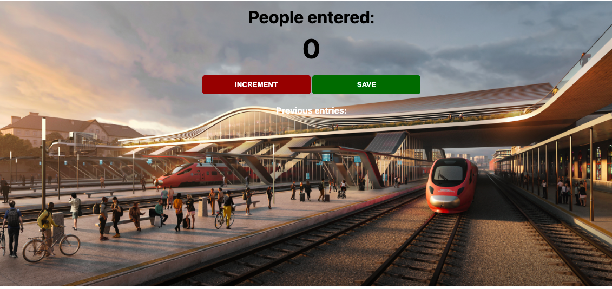

# Train Passenger Counter

### A demo application, implementing JavaScript DOM manipulation on a train passenger counting system. It counts and logs the number of passengers entering the train at any stop or station.

